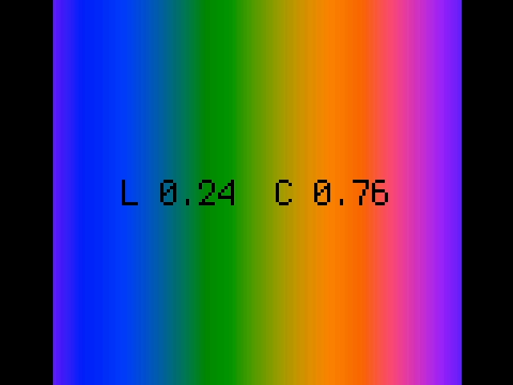
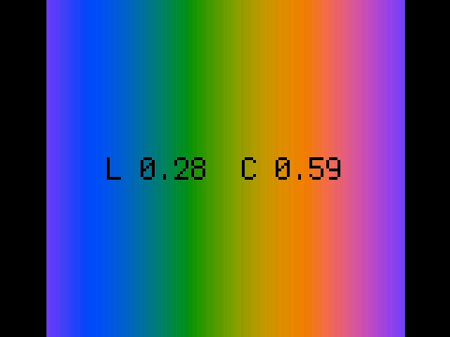
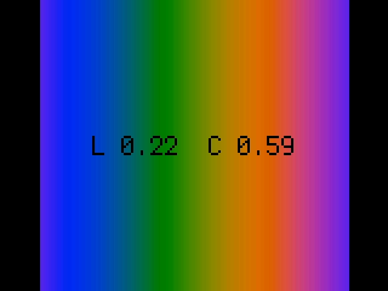
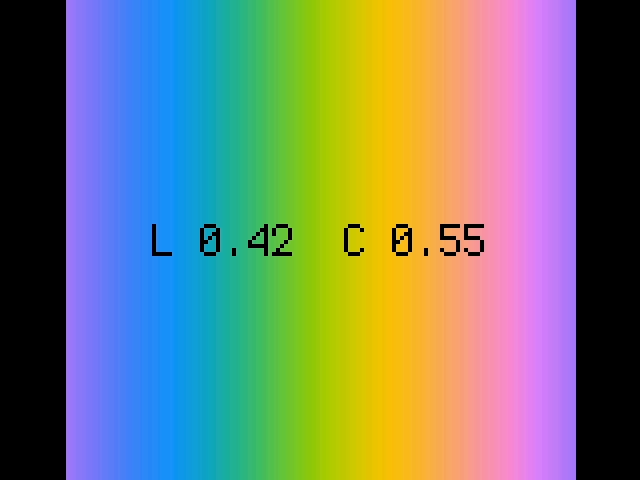

<!-- SPDX-License-Identifier: MIT -->
<!-- SPDX-FileCopyrightText: Copyright 2025 Sam Blenny -->
# Fruit Jam Color Gradient

This generates rainbow swirl color palettes in the LCh color space for picodvi
displays on RP2350 boards. You can use the WASD keys on the serial console to
adjust the Lightness and Chroma, but hue angle is generated automatically. The
point of this is to make palettes for Metro RP2350 or Fruit Jam that will look
good for making color swirl animations.

The default picodvi video mode is hardcoded to 320x240 16-bit, using an 8-bit
bitmap and a palette of 256 colors selected from the 65536 possible RGB565
colors. On boards with PSRAM (Fruit Jam), you can edit the code to use 320x240
32-bit for smoother gradients.

This code was developed and tested on CircuitPython 10.0.0-alpha.7 with a Metro
RP2350 (no PSRAM version) and a pre-release revision B Fruit Jam prototype.
Keep in mind that things may change by the time CircuitPython 10.0.0 is
released.

## Video Mode Board Compatibility

It seems like you need a board with a PSRAM chip in order to use 640x480 with
8-bit color depth. The 320x240 8-bit and 16-bit modes are more reliable. This
table summarizes the results of my video mode testing for the boards I had on
hand:

| Video Mode     | Fruit Jam | Metro RP2350 No PSRAM    |
| -------------- | --------- | ------------------------ |
| (320, 240,  8) | Yes!      | Yes!                     |
| (320, 240, 16) | Yes!      | Yes!                     |
| (320, 240, 32) | Yes!      | MemoryError exception :( |
| (640, 480,  8) | Yes!      | MemoryError exception :( |
